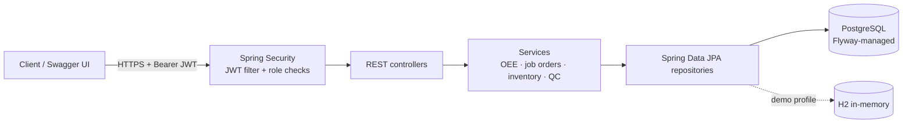
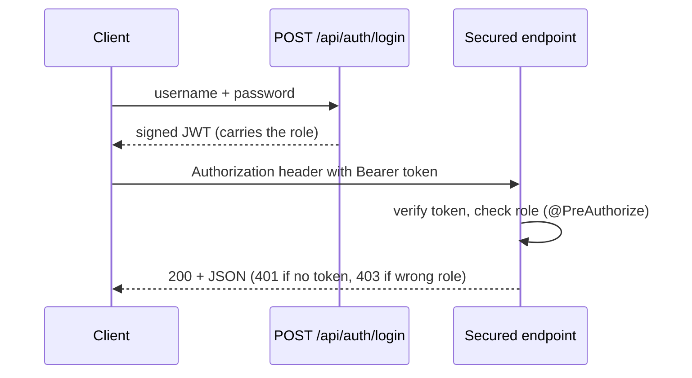
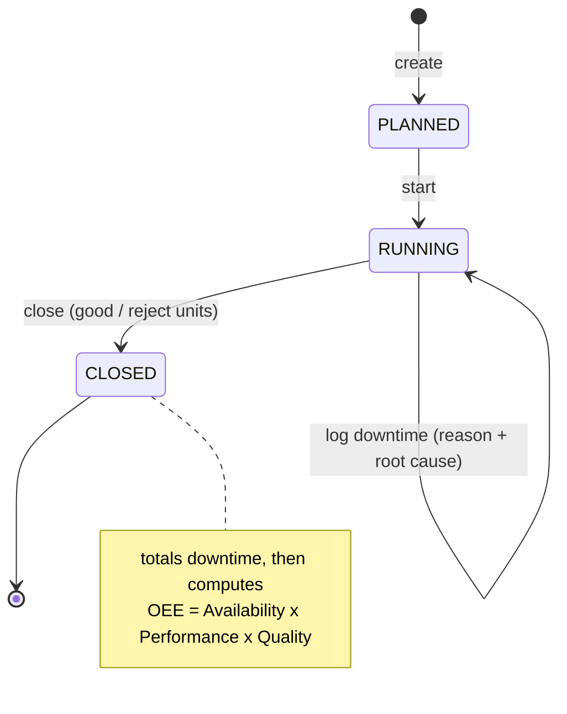

# ShopFloor API — MES / OEE backend

[](https://github.com/saad-mughal435/shopfloor-api/actions/workflows/ci.yml)
[](https://adoptium.net/)
[](https://spring.io/projects/spring-boot)
[](LICENSE)

[](https://render.com/deploy?repo=https://github.com/saad-mughal435/shopfloor-api)

**▶ Live API (Swagger):** **<https://shopfloor-api-lvb0.onrender.com/swagger-ui.html>** — log in via `POST /api/auth/login` with `manager` / `password`, click **Authorize**, and try every endpoint. (Free instance — the first request after idle takes ~50s to wake.)

A production-floor operations backend - **job orders, real-time OEE, downtime &
root-cause logging, QC holds, and FIFO inventory** - built on **Spring Boot 3,
Spring Data JPA, Spring Security (JWT), Flyway + PostgreSQL, and OpenAPI**.

> **Why this exists.** I ([Muhammad Saad](https://saadm.dev)) built and run a
> production MES/ERP for a beverage plant, written in Python/FastAPI. That
> system is private, so this repo rebuilds the same domain - OEE, batch
> close-out, downtime, QC, stock - in the open, on the Spring stack. Every
> demo data point is fabricated.

---

## What it does

| Area | Endpoints | Notes |
|------|-----------|-------|
| **Auth** | `POST /api/auth/login` | Returns a signed JWT carrying the user's role |
| **Lines** | `GET /api/lines` · `POST /api/lines` · `GET /api/lines/{id}/oee` | Rolling OEE per line |
| **Job orders** | `POST /api/job-orders` · `/{id}/start` · `/{id}/close` · `GET …` | **Close computes OEE** from run results |
| **Downtime** | `POST /api/job-orders/{id}/downtime` · `GET …` | Minutes + reason + root cause; feeds Availability |
| **Quality** | `POST /api/qc/holds` · `/{id}/release` · `GET /api/qc/holds` | Open/release holds with severity |
| **Inventory** | `GET /api/inventory` · `/items` · `/receipts` · `/issues` · `/{sku}/movements` | **FIFO** issues across lots + movement ledger |

### OEE, the way the plant measures it

```
OEE = Availability × Performance × Quality

Availability = run time / planned time        (run time = planned − downtime)
Performance  = ideal time for the units made / run time   (ideal time uses the line's rated units/hour)
Quality      = good units / total units
```

The math lives in one small, fully unit-tested class
([`OeeCalculator`](src/main/java/dev/saadm/shopfloor/service/OeeCalculator.java)) and
is exercised end-to-end when a job order is closed.

## Architecture & how it works

**Layered architecture** — every request flows through Spring Security (JWT), a thin
REST controller, a service holding the business logic, and a Spring Data JPA
repository onto the database:



**Authentication & request flow** — log in once for a token, then send it on every call:



**Job order → OEE lifecycle** — closing a run is what computes OEE:



## Roles (method-level security)

| Role | Can do |
|------|--------|
| `MANAGER` | Everything — create lines, create job orders, plus all operator/QC actions |
| `OPERATOR` | Start/close job orders, log downtime, receive/issue inventory |
| `QC` | Raise and release QC holds |

Demo users (seeded on first start, password `password`): **`manager`**, **`operator`**, **`qc`**.

## Run it

**Live demo:** the **Deploy to Render** button above (free) stands up a live instance running the self-contained H2 profile — the Swagger UI comes up with seeded data, no database to manage. Free instances sleep after inactivity, so the first request wakes it in ~30-60s.

**With Docker (PostgreSQL + Flyway, nothing else to install):**

```bash
docker compose up --build
# → http://localhost:8080/swagger-ui.html
```

**With Maven (self-contained H2, no database needed):**

```bash
mvn spring-boot:run
# → http://localhost:8080/swagger-ui.html
```

Then in Swagger: `POST /api/auth/login` with `{"username":"manager","password":"password"}`,
copy the `token`, click **Authorize**, paste it, and call the rest.

```bash
# or from the shell
TOKEN=$(curl -s localhost:8080/api/auth/login \
  -H 'Content-Type: application/json' \
  -d '{"username":"manager","password":"password"}' | jq -r .token)

curl -s localhost:8080/api/lines/1/oee -H "Authorization: Bearer $TOKEN"
```

## Tech & engineering choices

- **Spring Boot 3.3 / Java 21**, constructor injection, records for DTOs.
- **Spring Data JPA / Hibernate** over **PostgreSQL** in production; **H2** for the
  zero-setup demo profile and fast tests.
- **Flyway** owns the production schema (`V1__init.sql`); Hibernate runs in
  `validate` mode against it, so schema and entities can't silently drift.
- **Spring Security 6** as an OAuth2 resource server — HS256 JWTs, role claims
  mapped to authorities, `@PreAuthorize` method security, stateless sessions.
- **springdoc OpenAPI** with a bearer-auth scheme wired into Swagger UI.
- **Tested**: JUnit 5 unit tests for the OEE math, a MockMvc end-to-end
  job-order/OEE + RBAC flow, a FIFO inventory test, and a **Testcontainers**
  PostgreSQL integration test that proves the Flyway migration matches the
  entities. CI runs `mvn verify` on JDK 21 with Docker.

## Project layout

```
src/main/java/dev/saadm/shopfloor
├── domain/      JPA entities + enums
├── repo/        Spring Data repositories
├── dto/         request/response records (+ mapping factories)
├── service/     business logic — OeeCalculator, job orders, inventory (FIFO), auth/JWT
├── web/         REST controllers + global error handling
└── config/      security, OpenAPI, demo data seeder
src/main/resources
├── application.yml             # default: H2 demo profile
├── application-postgres.yml    # production: PostgreSQL + Flyway
└── db/migration/V1__init.sql   # Flyway schema
```

## License

MIT © 2026 Muhammad Saad · [saadm.dev](https://saadm.dev)
